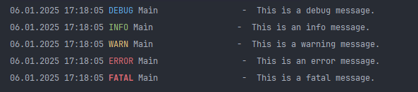

# 🌈 Colored Log4j Console Output 

Этот проект демонстрирует, как настроить цветной вывод логов в консоль с использованием Log4j 🪵.  Вместо стандартного монохромного вывода, ваши логи будут отображаться разными цветами в зависимости от их уровня (DEBUG, INFO, WARN, ERROR, FATAL). Это значительно улучшает читаемость и позволяет быстро выявлять проблемы в консоли. 👀

## Содержание
1. [Как это работает?](#-как-это-работает)
2. [Настройка](#-настройка)
3. [Код `ColoredPatternLayout.java`](#-код-coloredpatternlayoutjava)
4. [Цвета и уровни логирования](#-цвета-и-уровни-логирования)
5. [Пример вывода](#-пример-вывода)
6. [Замечания](#-замечания)

## 🚀 Как это работает?

Мы используем кастомный класс `ColoredPatternLayout` 🎨, который наследуется от `org.apache.log4j.Layout` и предоставляет свой механизм форматирования логов. Вместо стандартного механизма форматирования `PatternLayout`, мы самостоятельно формируем строку лога, используя ANSI-коды для добавления цветов.

## ⚙️ Настройка

1.  **Создайте класс `ColoredPatternLayout.java`**:
    *   Скопируйте код класса `ColoredPatternLayout` (см. ниже) в ваш проект.
    *   Убедитесь, что имя пакета соответствует вашей структуре.

2.  **Настройка `log4j.properties`**:
    *   В вашем файле `log4j.properties` замените `PatternLayout` на наш кастомный класс:

    ```properties
    log4j.appender.console=org.apache.log4j.ConsoleAppender
    log4j.appender.console.layout=com.example.ColoredPatternLayout
    ```
       или, если класс не в пакете:

     ```properties
    log4j.appender.console=org.apache.log4j.ConsoleAppender
    log4j.appender.console.layout=ColoredPatternLayout
    ```
    *   Убедитесь, что другие настройки (например, уровни логирования) соответствуют вашим потребностям.

3. **Компиляция:**
    * Скомпилируйте класс `ColoredPatternLayout.java`

4.  **Запуск приложения**:
    * Запустите ваше приложение и наслаждайтесь цветными логами. 🎉

## ⌨️ Код `ColoredPatternLayout.java`

```java
package com.example;

import org.apache.log4j.Layout;
import org.apache.log4j.spi.LoggingEvent;
import java.text.SimpleDateFormat;
import java.util.Date;

public class ColoredPatternLayout extends Layout {

    private final SimpleDateFormat dateFormat = new SimpleDateFormat("dd.MM.yyyy HH:mm:ss,SSS");

    @Override
    public String format(LoggingEvent event) {
        String message = event.getMessage();
        String level = event.getLevel().toString();
        String loggerName = event.getLoggerName();


        String colorCode;
        switch (level) {
            case "DEBUG": colorCode = "\u001B[34m"; break;
            case "INFO":  colorCode = "\u001B[32m"; break;
            case "WARN":  colorCode = "\u001B[33m"; break;
            case "ERROR": colorCode = "\u001B[31m"; break;
            case "FATAL": colorCode = "\u001B[31;1m"; break;
            default:      colorCode = "";
        }


        String formattedDate = dateFormat.format(new Date(event.getTimeStamp()));
        String formattedLevel = String.format("%-5s", colorCode + level + "\u001B[0m");
        String formattedLoggerName = String.format("%-20s", loggerName);


        String formattedMessage = String.format("%s %s %s - %s %s",
                formattedDate,
                formattedLevel,
                formattedLoggerName,
                threadName,
                message);


        return formattedMessage + "\n";
    }


    @Override
    public boolean ignoresThrowable() {
        return true;
    }

    @Override
    public void activateOptions() {
        // Nothing to do
    }
}
```

## 🧑‍💻

```java
public static void main(String[] args) {
        log.debug("This is a debug message.");
        log.info("This is an info message.");
        log.warn("This is a warning message.");
        log.error("This is an error message.");
        log.fatal("This is a fatal message.");

        licenseLog.info("License log info message");
    }
```

## 🎨 Цвета и уровни логирования

Мы используем ANSI-коды для выделения уровней логирования цветом, что делает логи более читаемыми:

*   **DEBUG:**  Синий 💙
*   **INFO:** Зеленый 💚
*   **WARN:** Желтый 💛
*   **ERROR:** Красный 💖
*   **FATAL:** Жирный Красный 💔

## 🖼️ Пример вывода



## 💡 Замечания

1. Вы можете настроить цвета и формат вывода в методе `format()` класса `ColoredPatternLayout`.
2. При настройке `log4j.properties` убедитесь что вы указали правильный `Layout`.
3. Не смог выровнить message по вертикали, нужно проработать форматирование

